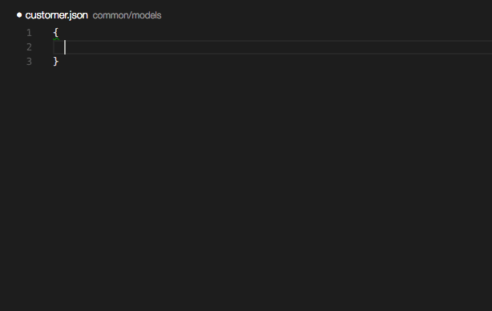
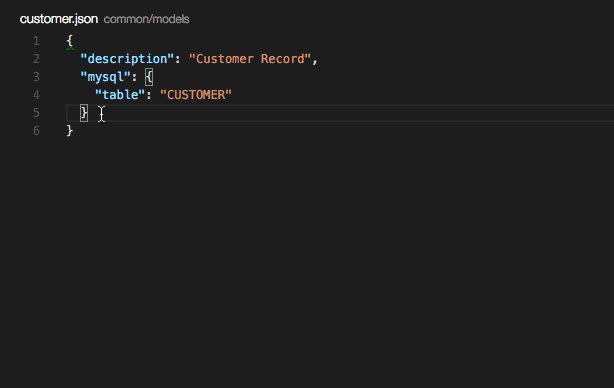
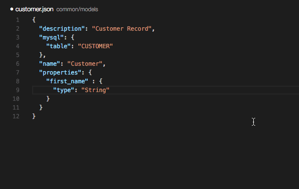
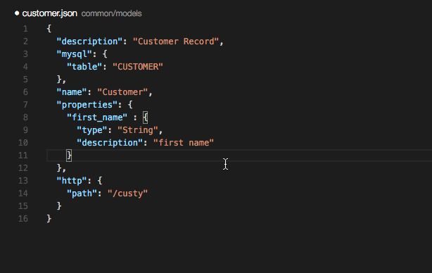
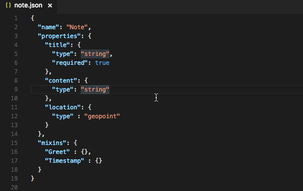

This extension links some [JSONSchemas](http://json-schema.org) to [Loopback](https://docs.strongloop.com/display/APIC/Using+LoopBack+with+IBM+API+Connect) configuration files.

**THIS IS AN INCOMPLETE BETA RELEASE**. Given the nature of loopback, schemas may never be 100% complete. Schemas used by this plugin can be found [here](https://github.com/Sequoia/loopback-json-schemas).

# Currently implemented schemas
1. `model-config.json`
2. Model definitions (`/common/models/customer.json` etc.)

Lots to-do!

# Gifs!

## Code hints
The plugin prompts you as you type

## Green Squiggles
If you have a mismatched type or missing property, you'll get a green squiggle underline

## `Ctrl+Space`
Hit `ctrl+space` to be shown available properties

It also works for enum types

## Links
You can click links to read extended documentation

